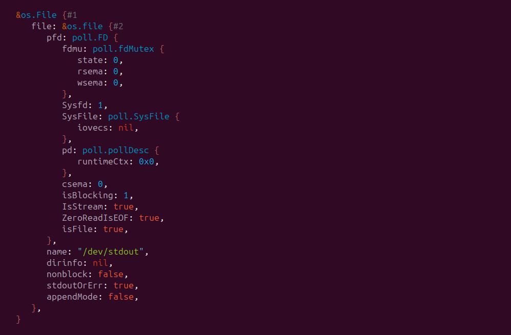

<div align="center">

<div width="50px" height="50px">


</div>

<h1> godump </h1>
</div>

<div align="center">

[](https://github.com/yassinebenaid/godump/actions/workflows/test.yml)
[](https://badge.fury.io/gh/yassinebenaid%2Fgodump)
[](./LICENCE)
[](https://pkg.go.dev/github.com/yassinebenaid/godump)

</div>

A versatile Go library designed to output any Go variable in a structured and colored format.

This library is especially useful for debugging and testing when the standard fmt library falls short in displaying arbitrary data effectively. It can also serve as a powerful logging adapter, providing clear and readable logs for both development and production environments.

`godump` is not here to replace the `fmt` package. Instead, it provides an extension to what the `fmt.Printf("%#v")` can do.

## Why godump

- ability to pretty print values of all types
- coloreful output
- unexported structs are dumped too
- pointers are followed and recursive pointers are taken in mind
- customizable
- zero dependencies

## Get Started

Install the library:

```bash
go get -u github.com/yassinebenaid/godump
```

Then use the **Dump** function:

```go
package main

import (
	"github.com/yassinebenaid/godump"
)

func main() {
	godump.Dump("Anything")
}

```

## Cusomization

If you need more control over the output. Use the `Dumper`

```go
package main

import (
	"os"

	"github.com/yassinebenaid/godump"
)

func main() {

	var v = "Foo Bar"
	var d = godump.Dumper{
		Indentation:       "  ",
		HidePrivateFields: false,
		Theme: godump.Theme{
			String: godump.RGB{R: 138, G: 201, B: 38},
			// ...
		},
	}

	d.Print(v)
	d.Println(v)
	d.Fprint(os.Stdout, v)
	d.Fprintln(os.Stdout, v)
	d.Sprint(v)
	d.Sprintln(v)
}

```

## Demo

### Example 1.

```go
package main

import (
	"os"

	"github.com/yassinebenaid/godump"
)

func main() {
	godump.Dump(os.Stdout)
}

```

Output:



### Example 2.

```go
package main

import (
	"net"

	"github.com/yassinebenaid/godump"
)

func main() {
	godump.Dump(net.Dialer{})
}

```

Output:


For more examples, please have a look at [dumper_test](./dumper_test.go) along with [testdata](./testdata)

## Contribution

Anyone can contribute to `godump`, you don't have to wite code (ofcourse you can if you like), feel free to suggest improvements, new features and report bugs.

The whole point of `godump` is to provide a formatted, structured and well looking form of your variables. And For the sake of simplicity, we're trying to keep the api minimal and simple, without unecessary/unrelated features, And ofcourse the code should be well tested.

Please make sure your contribution respects the mentioned conventions.
